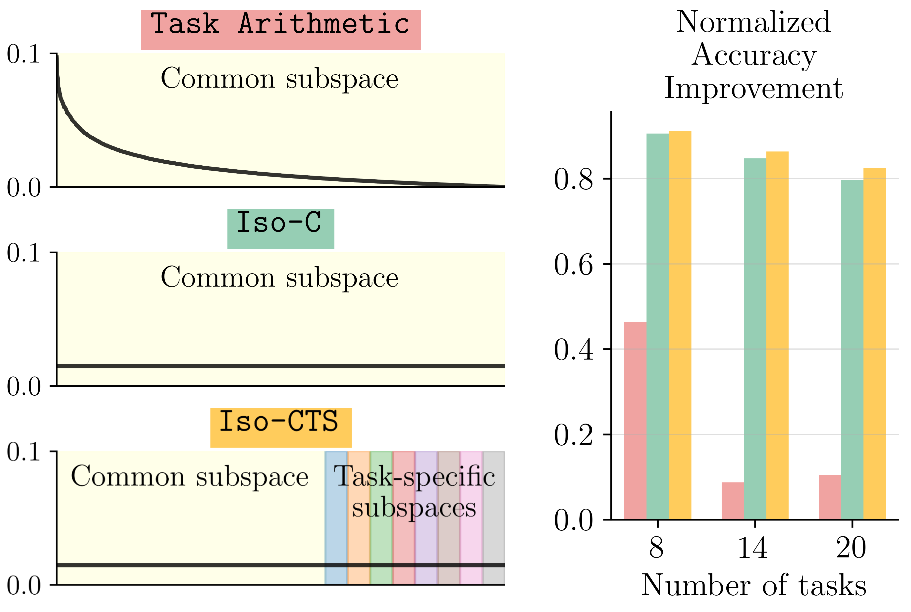

# No Task Left Behind: Isotropic Model Merging with Common and Task-Specific Subspaces
[](https://arxiv.org/abs/2502.04959)

<div align="left"></div>

> Spectrum of singular values for a single layer weight update matrix obtained by merging using Task Arithmetic (top) compared to our approaches: Iso-C (middle) and Iso-CTS (bottom). Task Arithmetic sums the task-specific matrices, which result in a spectrum with a few dominant components. Iso-C instead replaces this spectrum with a uniform one, which results in significant performance improvement. Iso-CTS enhances the common subspace with task-specific subspaces and yields state-of-the-art model merging performance.


## 🚀 Setup

### Download fine-tuned checkpoints
Use the checkpoints provided by [Task Singular Vectors](https://drive.google.com/drive/folders/1UEM1Thcz1c7dc1nji1i5uTN53Kf6G3-e?usp=sharing) (which are the same as provided by [Tall Masks](https://drive.google.com/drive/folders/15ParSng4d5xSdaWdBFsg1617zPXT8Dae)). 

### Download the datasets
Most datasets being used should be downloaded automatically with `torchvision` or `huggingface`. For the datasets requiring manual preparation (like Cars, DTD, EuroSAT, SUN397), please follow the instructions in [this issue](https://github.com/mlfoundations/task_vectors/issues/1). Depending on the `torchvision` version, some issues might arise when downloading specific datasets like [here](https://github.com/basveeling/pcam/issues/4) or [here](https://github.com/pytorch/vision/issues/5662). In this case, using a different `torchvision` version might solve the issue. 

### Set data and models locations
Modify `model_location` and `data_location` in `config/config.yaml` before evaluation. 

### Prepare the environment
```bash
conda env create
conda activate iso-merging
```


## 🔄 Merging methods
### `Iso-C`: Isotropic Merging in Common Subspace
tldr ✅: Merge by Task Arithmetic (summation) and make the spectrum of singular values uniform.
### `Iso-CTS`: Isotropic Merging in Common and Task-Specific Subspaces
tldr ✅: Merge by Task Arithmetic (common subspace), replace the least significant singular vectors by task-specific ones (task-specific subspaces) and and make the spectrum of singular values uniform.


## 🧪 Merge and eval
```bash
model=ViT-B-16
num_tasks=8

# Merge and evaluate Iso-C
python main.py method="iso_c" model=${model} num_tasks=${num_tasks}

# Merge and evaluate Iso-CTS
python main.py method="iso_cts" model=${model} num_tasks=${num_tasks} method.common_space_fraction=0.8
```


## 📚 Reference
If you find this code useful, please cite the following paper:
```bibtex
@article{marczak2025notaskleftbehind,
  title   = {{N}o {T}ask {L}eft {B}ehind: {I}sotropic {M}odel {M}erging with {C}ommon and {T}ask-{S}pecific {S}ubspaces},
  author  = {Daniel Marczak and Simone Magistri and Sebastian Cygert and Bartłomiej Twardowski and Andrew D. Bagdanov and Joost van de Weijer},
  year    = {2025},
  journal = {arXiv preprint arXiv: 2502.04959}
}
```


## 🤝 Acknowledgements

Code adapted from [Task Singular Vectors](https://github.com/AntoAndGar/task_singular_vectors) and [Tall Masks](https://github.com/nik-dim/tall_masks).

